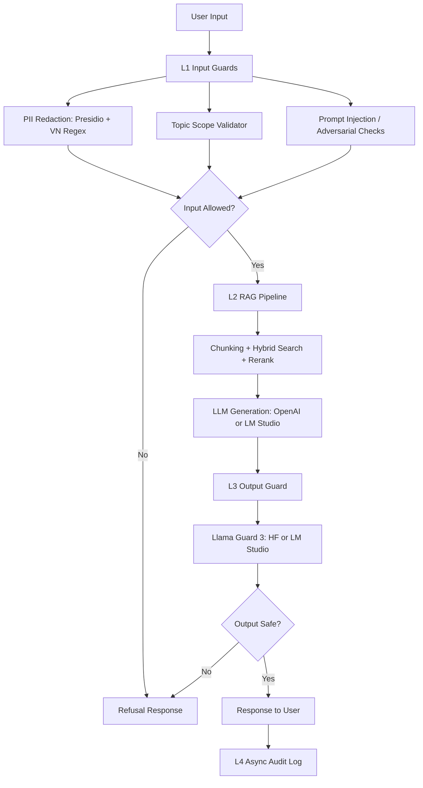

# Lab 24 Production Blueprint

## 1. SLO Definition

| Metric | Current | Target | Alert Threshold | Severity |
|---|---:|---:|---:|---|
| Faithfulness | 0.720 | >= 0.85 | < 0.80 for 30 min | P2 |
| Answer Relevancy | 0.760 | >= 0.80 | < 0.75 for 30 min | P2 |
| Context Precision | 0.892 | >= 0.70 | < 0.65 for 1 hour | P3 |
| Context Recall | 0.865 | >= 0.75 | < 0.70 for 1 hour | P3 |
| P95 Latency with Guardrails | TBD | < 2.5s | > 3s for 5 min | P1 |
| Guardrail Detection Rate | TBD | >= 90% | < 85% | P2 |
| False Positive Rate | TBD | < 5% | > 10% | P2 |

## 2. Architecture Diagram

Latency budget:

- L1 input guards: target P95 < 50ms.
- L2 RAG generation: target P95 < 2.0s.
- L3 output guard: target P95 < 100ms for local/API guard.
- L4 audit log is async and excluded from response budget.

## 3. Alert Playbook

### Incident: Faithfulness drops below 0.80

**Severity:** P2  
**Detection:** Continuous RAGAS eval alert.  
**Likely causes:** prompt drift, weak context grounding, corpus update without re-index.  
**Investigation steps:** compare context precision/recall, inspect recent prompt changes, sample bottom failures.  
**Resolution:** rollback prompt, tighten evidence-only generation, re-index corpus if retrieval also degraded.

### Incident: P95 latency exceeds 3s

**Severity:** P1  
**Detection:** latency benchmark or production monitoring.  
**Likely causes:** Llama Guard API latency, reranker slowdown, LM Studio model cold start.  
**Investigation steps:** split timings by L1/L2/L3, check model server logs, compare with baseline no-guardrail run.  
**Resolution:** cache embeddings, reduce top-k, move output guard to local GPU/API, or add timeout fallback.

### Incident: Guardrail detection below 85%

**Severity:** P2  
**Detection:** adversarial test regression.  
**Likely causes:** topic validator threshold too low, missing jailbreak patterns, output guard unavailable.  
**Investigation steps:** review false negatives by attack type, verify provider mode, inspect raw guard result.  
**Resolution:** tune thresholds, add patterns, enforce HF/LM Studio Llama Guard availability for production.

## 4. Monthly Cost Analysis

Assumption: 100k user queries/month.

| Component | Unit Cost | Volume | Monthly Cost |
|---|---:|---:|---:|
| RAG generation with GPT-4o-mini | $0.001/query | 100k | $100 |
| RAGAS continuous eval on 1% sample | $0.01/query | 1k | $10 |
| LLM judge on 10% sample | $0.001/query | 10k | $10 |
| Higher-quality judge spot checks | $0.05/query | 1k | $50 |
| Presidio / regex input guard | self-hosted | 100k | $0 |
| Llama Guard local GPU | $0.30/hour | 720h | $216 |
| **Estimated total** | | | **$386** |

Cost optimization:

- Use LM Studio/local models for development and non-critical eval runs.
- Sample judge traffic by risk tier.
- Cache retrieved contexts and embeddings.
- Use deterministic guardrails before expensive model-based guardrails.
